# 📘 MATLAB Lab Programs - BCA 2nd Semester (Tribhuvan University)

This repository contains MATLAB lab programs completed as part of the BCA 2nd Semester coursework at Tribhuvan University (TU). It covers core topics in Calculus and Numerical/Computational Methods, including limits, derivatives, antiderivatives, differential equations, and iterative numerical solvers.

Each section below shows the program's purpose, a link to its source code, and its actual output captured from MATLAB.

---

## 🧮 Topics Covered

| # | Topic |
|---|-------|
| 1 | [Limit and Continuity](#1-limit-and-continuity) |
| 2 | [Derivative](#2-derivative) |
| 3 | [Application of Derivatives](#3-application-of-derivatives) |
| 4 | [Antiderivatives & Applications](#4-antiderivatives--applications) |
| 5 | [Differential Equations](#5-differential-equations) |
| 6 | [Computational Method](#6-computational-method) |

---

## 1. Limit and Continuity

### 🔹 Limit (Numerical & Symbolic Evaluation)
Evaluates the limit of a rational function as x → 2, both numerically (approaching from both sides) and symbolically using MATLAB's Symbolic Math Toolbox.

### 🔹 Continuity (Piecewise Function)
Defines a piecewise function and checks its behavior around the breakpoint.

---

## 2. Derivative

Computes the first, second, and third symbolic derivatives of a cubic function, along with a numerical derivative using the central difference method.

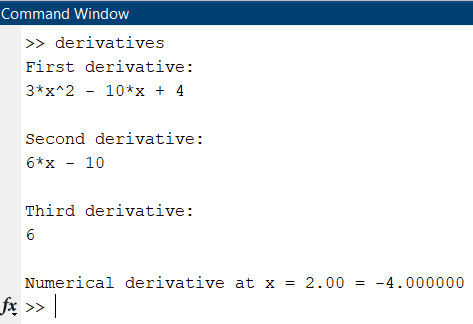

---

## 3. Application of Derivatives

Finds the critical points of a cubic function, classifies them as local maxima/minima using the second derivative test, and plots the function.

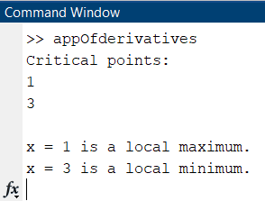

**Graph:**

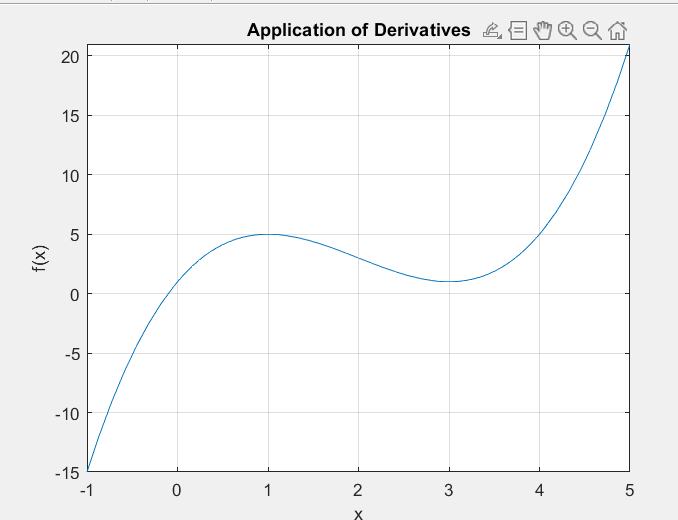

---

## 4. Antiderivatives & Applications

Computes the indefinite integral, definite integral, and numerical integral of a quadratic function, and plots the area under the curve.

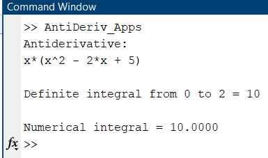

**Area Under Curve Graph:**

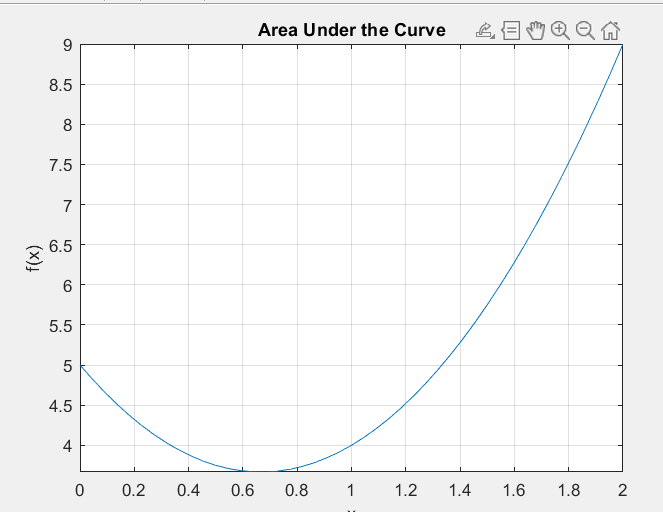

---

## 5. Differential Equations

Solves a first-order ODE symbolically (general solution and with an initial condition) and numerically using ode45, with a plotted solution curve.

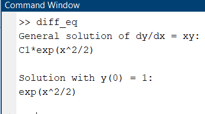

**Graph:**

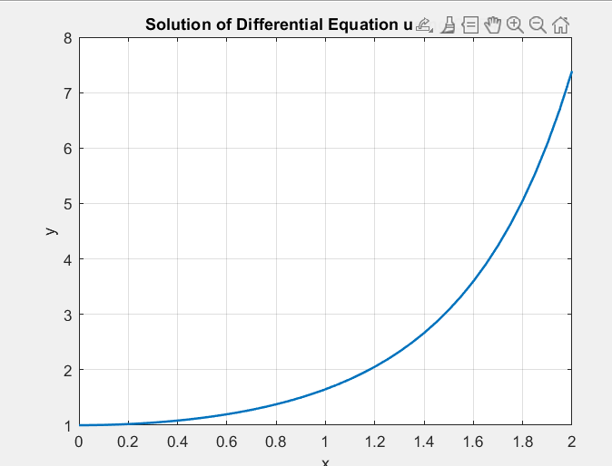

---

## 6. Computational Method

### 🔹 Bisection Method
Finds the root of a nonlinear equation using the bisection method.

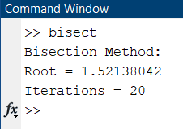

### 🔹 Newton-Raphson Method
Finds the root of the same equation using the Newton-Raphson iterative method.

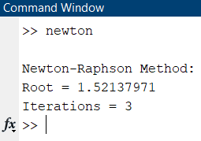

### 🔹 Gauss-Seidel Method
Solves a system of linear equations iteratively using the Gauss-Seidel method.

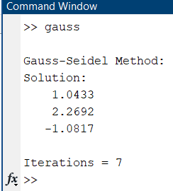

### 🔹 Simplex / Linear Programming Method
Solves a linear programming maximization problem using MATLAB's linprog function.

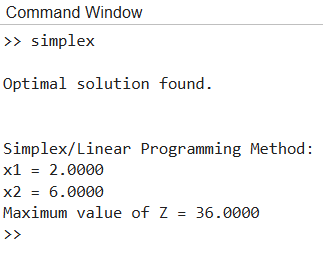

---

## 🛠️ Requirements

- MATLAB (R2020a or later recommended)
- Symbolic Math Toolbox
- Optimization Toolbox (for the Simplex method)

---

## 👤 Author

BCA 2nd Semester Student
Tribhuvan University (TU)

## 📄 License

This project is for academic/educational purposes.